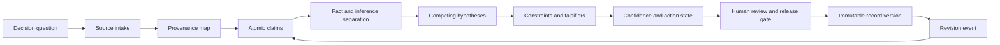

# Architecture

## System purpose

RECORD LOCK transforms a decision question and its source record into a reproducible analytical object. The system preserves what was known, which assumptions were used, how alternatives were tested, what confidence was assigned, and what evidence would change the judgment.

## Components

### Decision-question registry

Defines the exact question, decision owner, analytical horizon, scope, exclusions, and required evidence.

### Source registry

Stores stable source identifiers, issuer or author, date, access date, source class, independence assessment, rights constraints, and integrity notes.

### Claim ledger

Breaks narrative material into atomic claims. Each claim is assigned a type, state, supporting sources, contradictions, assumptions, and an evidence ceiling.

### Competing-hypothesis layer

Represents the strongest plausible alternatives and records which observations discriminate between them. A preferred thesis is not approved until the strongest contrary case is addressed.

### Constraint and trigger map

Identifies binding constraints, gate states, activation triggers, and conditions that prevent an outcome even when narrative momentum points toward it.

### Confidence and action router

Assigns confidence only after evidence, alternatives, and constraints are reviewed. The analytical conclusion is separated from the recommended action state.

### Record versioning

Every released record receives a stable identifier and version. Material changes create a new version with a dated reason rather than silently overwriting the prior judgment.

## Integrity model

A valid record should preserve:

- source identity and provenance;
- the exact proposition being evaluated;
- evidence supporting and contradicting it;
- assumptions and analytical dependencies;
- alternative explanations;
- confidence and its basis;
- falsifiers and revision conditions;
- reviewer identity and approval time;
- the relationship between conclusion and action.

## Public versus restricted data

A production system should maintain separate stores for:

- restricted source files;
- internal research notes;
- public-safe source metadata;
- reviewed claim records;
- public exports;
- credentials and deployment configuration;
- correction and moderation evidence.

Only approved public fields should enter a public build artifact.

## Release gate

1. Decision question is precise and time-bounded.
2. Source provenance and independence are assessed.
3. Claims are atomic and correctly typed.
4. Facts and inferences are separated.
5. Strongest competing hypothesis is represented.
6. Binding constraint and falsifier are explicit.
7. Confidence is supported by the record.
8. Action state is separated from analytical confidence.
9. Privacy, security, and rights checks pass.
10. Automated validation and human review pass.
